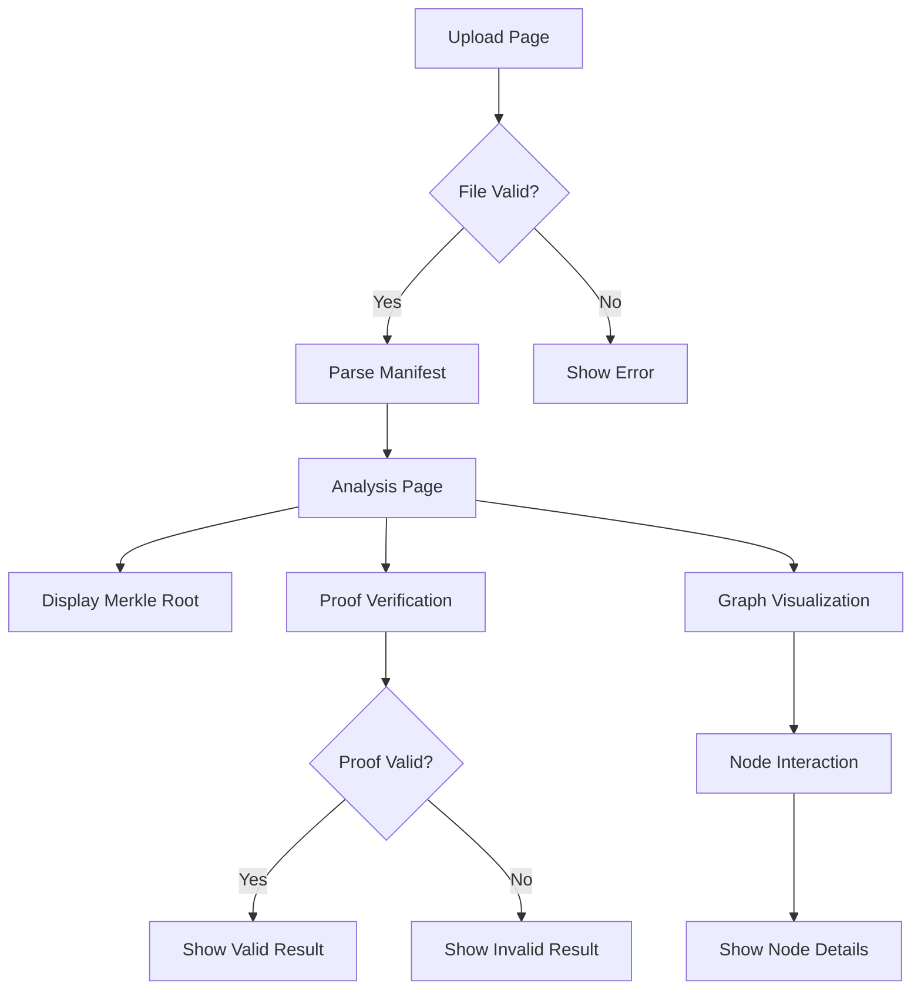

## 1. Product Overview
A web application for loading and analyzing .symbi manifest files, displaying merkle root information, verifying cryptographic proofs, and visualizing hierarchical parent/branch relationships in an interactive graph format.

This tool helps developers and users verify the integrity and structure of Symbi manifest data through an intuitive interface.

## 2. Core Features

### 2.1 User Roles
No user authentication required - this is a public utility tool for manifest analysis.

### 2.2 Feature Module
The Symbi manifest viewer consists of the following main pages:
1. **Upload page**: File upload interface, manifest validation, loading state.
2. **Analysis page**: Merkle root display, proof verification interface, relationship graph visualization.

### 2.3 Page Details
| Page Name | Module Name | Feature description |
|-----------|-------------|---------------------|
| Upload page | File upload | Drag-and-drop or browse to select .symbi manifest files. Accept only valid .symbi file format. |
| Upload page | Validation | Parse and validate manifest file structure, display error messages for invalid files. |
| Upload page | Loading state | Show progress indicator during file processing and data extraction. |
| Analysis page | Merkle root display | Extract and prominently display the merkle root hash from the manifest. |
| Analysis page | Proof verification | Input field for proof data, verify button, display verification results (valid/invalid). |
| Analysis page | Graph visualization | Interactive tree/graph showing parent/branch relationships between manifest entries. |
| Analysis page | Node details | Click on graph nodes to view detailed information about each manifest entry. |
| Analysis page | Export options | Allow users to export verification results and graph data as JSON or image. |

## 3. Core Process
User uploads a .symbi manifest file → System validates and parses the file → Displays merkle root and manifest structure → User can verify proofs against the manifest → Interactive graph shows parent/branch relationships → User can explore individual nodes and export results.

## 4. User Interface Design

### 4.1 Design Style
- Primary colors: Deep blue (#1e40af) for headers, light gray (#f3f4f6) for backgrounds
- Button style: Rounded corners with subtle shadows, primary actions in blue
- Font: Inter or system fonts, 16px base size
- Layout style: Card-based layout with clear visual hierarchy
- Icons: Minimalist line icons for file operations and verification states

### 4.2 Page Design Overview
| Page Name | Module Name | UI Elements |
|-----------|-------------|-------------|
| Upload page | File upload | Large drag-and-drop zone with dashed border, browse button, file type indicator |
| Upload page | Validation | Inline error messages in red, success indicators in green |
| Analysis page | Merkle root | Prominent display card with monospace font for hash value |
| Analysis page | Proof verification | Input field with verify button, result badge with color coding |
| Analysis page | Graph | Interactive D3.js or similar force-directed graph with zoom/pan controls |

### 4.3 Responsiveness
Desktop-first design with mobile-adaptive layout. Touch interaction optimization for graph manipulation on mobile devices.

### 4.4 3D Scene Guidance
Not applicable - this is a 2D data visualization tool.