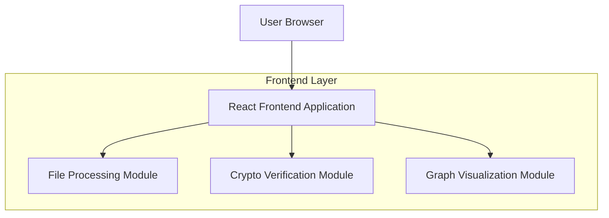
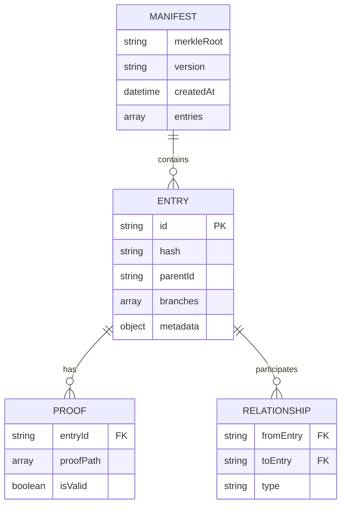

## 1. Architecture design

## 2. Technology Description
- Frontend: React@18 + tailwindcss@3 + vite
- Initialization Tool: vite-init
- Backend: None (client-side processing only)
- Additional Libraries: 
  - d3@7 for graph visualization
  - crypto-js@4 for cryptographic operations
  - react-dropzone@14 for file upload handling

## 3. Route definitions
| Route | Purpose |
|-------|---------|
| / | Upload page, main entry point for file upload |
| /analysis | Analysis page, displays manifest data and visualization |

## 4. API definitions
Not applicable - this is a client-side only application with no backend services.

## 5. Server architecture diagram
Not applicable - no server-side components required.

## 6. Data model

### 6.1 Data model definition

### 6.2 Data Definition Language
Not applicable - no persistent database required. Data is processed in-memory and discarded after session.