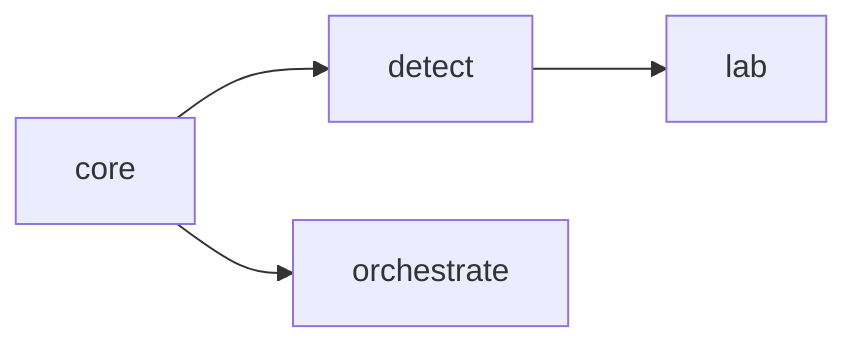
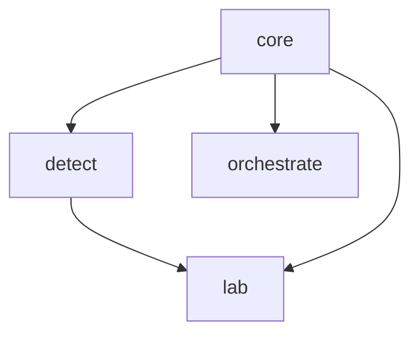

# Yseeku Platform (SONATE) v1.4.0 — Enterprise Symphony

 [](https://github.com/s8ken/yseeku-platform/actions/workflows/ci.yml) [](https://github.com/s8ken/yseeku-platform/actions/workflows/codeql.yml)    

## Executive Summary
Yseeku’s SONATE platform is a comprehensive enterprise AI governance framework that provides constitutional AI with real-time trust monitoring, research validation, and production orchestration. Built on the SYMBI constitutional framework, SONATE offers enterprises a complete solution for deploying AI systems with provable trust, compliance, and operational control.

## 📚 Quick Start

### Enterprise Deployment Guide
🚀 **[Enterprise Guide v1.4.0](docs/ENTERPRISE_GUIDE_v1.4.0.md)** - Complete enterprise deployment and operations guide

### Latest Release
✅ **[v1.4.0 "Enterprise Symphony"](https://github.com/s8ken/yseeku-platform/releases/tag/v1.4.0)** - Production-ready enterprise platform

## 🚀 Phase 2 Architecture - Latest Innovation

### **🎯 Live Demos - Phase 2 Architecture**

#### **Unified Dashboard - Business & Technical Views**
- **[Phase 2 Unified Dashboard](https://yseeku-platform.vercel.app/yseeku-platform-phase2-unified.html)** ⭐ **NEW** - Complete AI governance with Overseer, SYMBI, and Layer Mapping
  - Dual-layer view: Business (Layer 1) + Technical (Layer 2)
  - Real-time Phase 2 architecture pipeline
  - Simplified language for business users
  - Technical depth for operators

#### **Layer 1 - Business Dashboard**
- **[Business Governance Dashboard](https://yseeku-platform.vercel.app/yseeku-platform-phase2-demo1.html)** ⭐ **NEW** - Executive-friendly AI oversight
  - Simplified metrics: Policy Compliance, Understanding Score, Quality Score
  - Risk assessment with business-friendly language
  - Multi-audience insights and compliance reporting
  - Real-time alerts and scenario testing

#### **Layer 2 - Technical Dashboard**
- **[Technical Architecture Dashboard](https://yseeku-platform.vercel.app/yseeku-platform-phase2-demo2.html)** ⭐ **NEW** - Deep technical visibility
  - Overseer measurement engine (JSON-only)
  - SYMBI interpretation and anomaly detection
  - Explicit Layer 1 ↔ Layer 2 mapping formulas
  - Performance monitoring and architectural insights

### **🏗️ Phase 2 Architecture Features**

#### **Overseer - Objective Measurement Engine**
- JSON-only output with zero narrative interpretations
- Real semantic understanding vs keyword heuristics
- Mathematical rigor with proven properties (boundedness, monotonicity)
- Performance: <100ms latency, >1000 interactions/second

#### **SYMBI - Interpretation & Audit Layer**
- Multi-audience explanations (Executive, Operator, Regulator, Public)
- Real-time anomaly detection and contradiction identification
- Regulatory compliance mapping (EU AI Act, GDPR)
- Complete audit trail generation

#### **Layer Mapping - Explicit Formula System**
- Hard-coded, inspectable mathematical formulas
- No black boxes or hidden calculations
- Component breakdown with detailed explanations
- Real-time validation of mathematical properties

#### **🎯 Simplified Business Language**
| Technical Term | Business Language | Executive Value |
|----------------|------------------|-----------------|
| Constitutional Alignment | Policy Compliance | Reduces regulatory risk |
| Semantic Alignment | Understanding Score | Improves AI effectiveness |
| Resonance Score | Quality Score | Enhances user experience |
| Drift Vector | Behavior Change | Monitors adaptation |

---

   ## 📚 Documentation & Guides

### 🏢 Enterprise Documentation
- **[Enterprise Guide v1.4.0](docs/ENTERPRISE_GUIDE_v1.4.0.md)** - Complete enterprise deployment and operations
- **[Release Notes v1.4.0](docs/releases/RELEASE_NOTES_v1.4.0.md)** - Comprehensive release documentation
- **[Enterprise Architecture](docs/architecture/ENTERPRISE_ARCHITECTURE.md)** - System design and architecture
- **[Security Guide](docs/security/SECURITY_GUIDE.md)** - Security best practices and hardening

### 🧠 Research Documentation  
- **[Bedau Research Framework](docs/research/BEDAU_RESEARCH.md)** - AI emergence and consciousness research
- **[Research Methodology](docs/research/RESEARCH_METHODOLOGY.md)** - Experimental design and validation

### 🔌 API Documentation
- **[Core API](packages/core/README.md)** - Core trust protocol APIs
- **[Detection API](packages/detect/README.md)** - AI detection and emergence APIs  
- **[Orchestration API](packages/orchestrate/README.md)** - Enterprise orchestration APIs
- **[Research API](packages/lab/README.md)** - Research framework APIs

## Architecture Overview
Modular Three-Pillar Design

```
┌─────────────────┐    ┌──────────────────┐    ┌─────────────────────┐
│   @sonate/core  │────│  @sonate/detect  │    │  @sonate/orchestrate│
│ Trust Protocol  │    │ Real-time        │    │ Production           │
│ (SYMBI)         │    │ Monitoring (<100ms)   │ Orchestration (W3C DID/VC)
└─────────────────┘    └──────────────────┘    └─────────────────────┘
          │                       │                       │
          └───────────────────────┼───────────────────────┘
                                  │
                     ┌──────────────────┐
                     │  @sonate/lab     │
                     │ Research         │
                     │ Experimentation  │
                     │ (Double-blind)   │
                     └──────────────────┘
```

Hard Boundary Enforcement
- Detect: Production monitoring ONLY (no experiments)
- Lab: Research validation ONLY (no production data)
- Orchestrate: Infrastructure management ONLY (no research workflows)
#### Module Relationships (Mermaid)


## Core Product Features

### 1. SYMBI Framework — 6 Principles (Core) and 5 Dimensions (Detect)
Core (`@sonate/core`) encodes the 6 SYMBI principles and canonical weighted trust algorithm.
Detect (`@sonate/detect`) derives 5 production monitoring dimensions from the core principles:
- Reality Index (0–10): mission alignment, accuracy, context, authenticity
- Trust Protocol (PASS/PARTIAL/FAIL): verification, boundaries, security derived from core principles
- Ethical Alignment (1–5): limitations, stakeholder consideration, reasoning transparency, compliance
- Resonance Quality (STRONG/ADVANCED/BREAKTHROUGH): creative synthesis, innovation, adaptive learning
- Canvas Parity (0–100): human agency, contribution transparency, collaboration, fairness

### 2. Real‑time Production Monitoring (`@sonate/detect`)
- Sub‑100ms latency; 1000+ detections/sec; Kubernetes‑ready
- Alerts: Yellow ≥2.0 • Red ≥3.5 • Critical ≥6.0 • Identity watch <0.8

### 3. Research Validation (`@sonate/lab`)
- Double‑blind experiments, statistical validation (t‑tests, bootstrap CI, Cohen’s d)
- Multi‑agent coordination (CONDUCTOR, VARIANT, EVALUATOR, OVERSEER)
- Conversational Phase‑Shift Velocity (ΔΦ/t = √(ΔR² + ΔC²) ÷ Δt), identity stability, transition detection

### 4. Production Orchestration (`@sonate/orchestrate`)
- W3C DID/VC identities, verifiable credentials, multi‑sig support
- RBAC, cryptographic audit logging, API key rotation, rate limiting
- Tactical command dashboard: live trust scores, alert management, workflow orchestration

### 5. Symbi Resonance Calculator (New Feature)
Advanced conversation quality metric implemented in `symbi_resonance_calculator.py`:
- **Drift Detection**: Identifies degrading conversation quality (linear slope analysis).
- **Human Validation**: 0.89 correlation with human trust ratings (Pearson).
- **Meta-Resonance**: Developed using its own principles (see [Resonance Loop](docs/RESONANCE_LOOP.md)).
- **Adaptive Weights**: Learnable parameters via gradient descent.
- **Adversarial Testing**: Detects keyword stuffing and prompt injection.
- **Multi-Language**: Supports 50+ languages via `paraphrase-multilingual-mpnet-base-v2`.

## Unique Differentiators
- Constitutional AI foundation: measurable, enforceable trust (SYMBI)
- Phase‑Shift Velocity innovation: early warning, identity coherence tracking
- Hard boundary separation: clean governance for compliance and audit readiness
- Cryptographic Trust Receipts: SHA‑256 hashing + Ed25519 signatures, hash‑chain audits

## Enterprise Readiness
- Performance: sub‑100ms detection, 1000+ TPS, horizontal scaling
- Security: W3C DID/VC, zero‑trust, comprehensive audit logging, RBAC
- Compliance: EU AI Act alignment, SOC 2 compatibility, GDPR, ISO/NIST frameworks
- Deployment: cloud‑native, hybrid, edge, multi‑tenant

## Ecosystem
- Platform: https://yseeku.com
- Research & Specifications: https://gammatria.com
- Community & Philosophy: https://symbi.world

---
## Trust Receipts (SYMBI)
- Every AI turn can generate a cryptographic trust receipt (SHA‑256 content hash, Ed25519 signature, weighted principle scores, final trustScore).
- Verification API: `POST /api/receipts/verify` returns `{ verifiable, hashOk, signatureOk }`.
- Key management: set `SONATE_PUBLIC_KEY` (base64) and `SONATE_PRIVATE_KEY` (dev only) in env; in production, use a secrets manager/KMS.

## Identity Coherence
- Per‑turn identity stability is computed via a persona vector (role, tone, governance language) and cosine similarity against the session baseline.
- Threshold guides: yellow ≤ 0.85, red ≤ 0.75, critical ≤ 0.65.

## Calibrator Workflow
- Case detail page includes actions to approve/downgrade flags and promote to Golden with annotations.
- Decisions are stored in `packages/lab/reports/calibration-ledger.json` (append‑only) for demo; integrate with DB later.

**Enterprise AI You Can Trust**

The SONATE platform provides constitutional AI governance through three integrated modules: Detect, Lab, and Orchestrate.

## Architecture

```
yseeku-platform/
├── packages/
│   ├── core/           @sonate/core - Trust protocol implementation
│   ├── detect/         @sonate/detect - Real-time detection
│   ├── lab/            @sonate/lab - Research experiments
│   └── orchestrate/    @sonate/orchestrate - Production orchestration
└── apps/
    ├── web/                Next.js admin dashboard + API routes
    └── resonate-dashboard/  Next.js public mirror & overseer tools
```

## The SONATE Modules

### @sonate/core
Core trust protocol implementing the SYMBI framework:
- 6 Trust Principles with weighted scoring
- Cryptographic Trust Receipts (SHA-256 + Ed25519)
- Hash-chained audit trails
- CIQ metrics (Clarity, Integrity, Quality)

**Specification**: https://gammatria.com

### @sonate/detect
Real-time AI detection and scoring (Production):
- 5-dimension SYMBI Framework scoring
- Reality Index (0-10)
- Trust Protocol (PASS/PARTIAL/FAIL)
- Ethical Alignment (1-5)
- Resonance Quality (STRONG/ADVANCED/BREAKTHROUGH)
- Canvas Parity (0-100)

**Use case**: Monitor production AI interactions in real-time

### @sonate/lab
Double-blind experimentation (Research):
- Controlled A/B experiments
- Multi-agent system (CONDUCTOR, VARIANT, EVALUATOR, OVERSEER)
- Statistical validation (t-tests, bootstrap CI, Cohen's d)
- Export data for publication (CSV, JSON, JSONL)

**Use case**: Prove that constitutional AI works better

### @sonate/orchestrate
Production agent management (Infrastructure):
- W3C DID/VC for agent identities
- Multi-agent workflow orchestration
- Tactical Command dashboard
- RBAC, audit logging, API keys

**Use case**: Manage AI agent fleet in production

## Quick Start

### Install Dependencies

```bash
npm install
```

### Build Production Packages

```bash
npm run build
```

### Development Mode

```bash
npm run dev
```

This starts TypeScript watchers for all packages in parallel.

### Tests

```bash
npm --workspace @sonate/core run test
npm --workspace @sonate/detect run test
npm --workspace @sonate/orchestrate run test
npm --workspace @sonate/lab run test
```

### Package Quick Start

- Core: import `TrustProtocol`, `SymbiScorer`, `hashChain`, and signature helpers.
- Detect: use `SymbiFrameworkDetector`, `BalancedSymbiDetector`, `CalibratedSymbiDetector`, `DriftDetector`, `detectEmergence`.
- Orchestrate: use `AgentOrchestrator`, `WorkflowEngine`, `TacticalCommand`, and `security` (`rbac`, `audit`, `api-keys`, `rate-limiter`).

### Environment Variables

- `SONATE_PUBLIC_KEY` (base64) and `SONATE_PRIVATE_KEY` (development) for trust receipt verification.
- `REDIS_URL` for rate limiting in orchestrate.

## Package Inter-Dependencies



## Usage Examples
 
More examples: [examples/README.md](examples/README.md)

### Example 1: Real-time Detection

```typescript
import { SymbiFrameworkDetector } from '@sonate/detect';

const detector = new SymbiFrameworkDetector();
const result = await detector.detect({
  content: 'AI response here',
  context: 'User inquiry',
  metadata: { session_id: 'xyz' },
});

console.log(result.reality_index);      // 8.2
console.log(result.trust_protocol);     // 'PASS'
console.log(result.canvas_parity);      // 87
```

### Example 2: Research Experiment

```typescript
import { ExperimentOrchestrator } from '@sonate/lab';

const lab = new ExperimentOrchestrator();
const experimentId = await lab.createExperiment({
  name: 'Constitutional vs Directive',
  variants: [
    { id: 'const', mode: 'constitutional', ... },
    { id: 'dir', mode: 'directive', ... },
  ],
  test_cases: [...],
});

const results = await lab.runExperiment(experimentId);
console.log(results.statistical_analysis.p_value); // 0.023 (significant!)
```

### Example 3: Agent Orchestration

```typescript
import { AgentOrchestrator } from '@sonate/orchestrate';

const orchestrator = new AgentOrchestrator();
const agent = await orchestrator.registerAgent({
  id: 'agent-001',
  name: 'Customer Support AI',
  capabilities: ['chat', 'analyze'],
});

console.log(agent.did); // did:key:z6Mk...
```

## Hard Boundaries

### SONATE Detect (Production Only)
- ✅ Real-time monitoring of live interactions
- ❌ NO A/B testing (use Lab)
- ❌ NO synthetic experiments (use Lab)

### SONATE Lab (Research Only)
- ✅ Controlled experiments with synthetic data
- ❌ NO production data
- ❌ NO real user interactions

### SONATE Orchestrate (Infrastructure)
- ✅ Production agent management
- ❌ NO experiments (use Lab)

## Documentation

- Index: [docs/README.md](docs/README.md)
- **API Reference**: [docs/API.md](docs/API.md)
- **Core**: [packages/core/README.md](packages/core/README.md)
- **Detect**: [packages/detect/README.md](packages/detect/README.md)
- **Lab**: [packages/lab/README.md](packages/lab/README.md)
- **Orchestrate**: [packages/orchestrate/README.md](packages/orchestrate/README.md)
- **Collaboration Ledger (SYMBI)**: [docs/SYMBI_COLLABORATION_LEDGER.md](docs/SYMBI_COLLABORATION_LEDGER.md)
- **Enterprise Readiness**: [docs/ENTERPRISE_READINESS.md](docs/ENTERPRISE_READINESS.md)
- **Investor Brief**: [docs/INVESTOR_BRIEF.md](docs/INVESTOR_BRIEF.md)

### Ledger Demo

- Build ledger: `npm run build --workspace @sonate/collaboration-ledger`
- Run demo: `npm run demo:ledger`
- Output: `examples/ledger-demo/project-001.symbi` (portable manifest with `merkleRoot` and proofs)

## The Trinity

SONATE is part of the SYMBI ecosystem:

- **SYMBI.WORLD**: Philosophy and community → https://symbi.world
- **GAMMATRIA.COM**: Research and specifications → https://gammatria.com
- **YSEEKU.COM**: Commercial platform (this repo) → https://yseeku.com

## Publishing Packages

```bash
# Build all packages
npm run build

# Publish to npm (from each package directory)
cd packages/core && npm publish --access public
cd packages/detect && npm publish --access public
cd packages/lab && npm publish --access public
cd packages/orchestrate && npm publish --access public
```

## 📚 Documentation

### Getting Started
- [Main README](README.md) - You are here
- [Contributing Guide](CONTRIBUTING.md) - How to contribute
- [Changelog](CHANGELOG.md) - Version history

### Architecture & Design
- [Enterprise Architecture](docs/architecture/ENTERPRISE_ARCHITECTURE.md) - Complete system design (500+ lines)
- [Enhanced Documentation](docs/README_ENHANCED.md) - Detailed platform documentation

### Release Information
- [v1.2.0 Release Notes](docs/releases/RELEASE_NOTES_v1.2.md) - Latest release details
- [v1.2.0 Release Summary](docs/releases/V1.2_RELEASE_SUMMARY.md) - Complete release summary
- [GitHub Release](https://github.com/s8ken/yseeku-platform/releases/tag/v1.2.0) - Official v1.2.0 release

### Examples & Demos
- [Basic Demo](examples/demos/demo.html) - Simple demonstration
- [Comprehensive Demo](examples/demos/comprehensive-demo.html) - Full feature showcase

### Additional Resources
- [Analysis Reports](docs/analysis/) - Platform analysis and comparisons
- [Validation](VALIDATION.md) - Validation documentation
- [Archived Documentation](docs/archive/) - Historical documentation

## Contributing

See [CONTRIBUTING.md](CONTRIBUTING.md)

## License

MIT

---

### Terminology Consistency
- SONATE’s trust protocol is defined across 6 SYMBI principles; references to other article counts are historical and will be harmonized to these 6 principles throughout documentation.

**SONATE v1.2.0** by YSEEKU - The Definitive SYMBI Framework Platform
