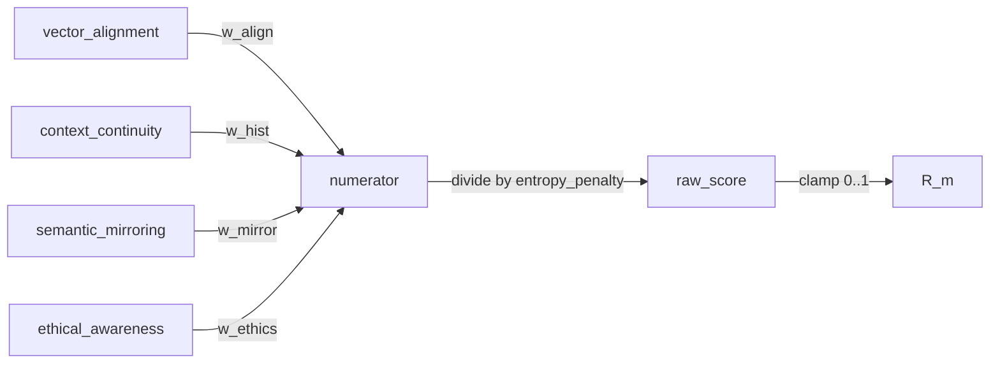

# SONATE Detect + Resonance Engine Overview

This guide provides a practical, developer‑focused overview of the Detect module and the Python Resonance Engine, how they integrate, and how to use them in your applications. It consolidates key source references and adds data‑flow diagrams, scoring composition, and Quickstart examples.

## Module Map
- Detect entry and types: `packages/detect/src/index.ts:13`
- Core 5‑D orchestration: `packages/detect/src/framework-detector.ts:18`
- Resonance (explainable + robust): `packages/detect/src/calculator.ts:110`, `packages/detect/src/calculator.ts:207`
- Adversarial defenses: `packages/detect/src/adversarial.ts:14`
- Stakes classification: `packages/detect/src/stakes.ts:31`
- Stickiness (session continuity): `packages/detect/src/stickiness.ts:25`
- Model normalization: `packages/detect/src/model-normalize.ts:22`
- Python engine calculator: `packages/resonance-engine/symbi_resonance_calculator.py:305`
- FastAPI endpoints: `packages/resonance-engine/api.py:30`
- TS client for Python engine: `packages/detect/src/resonance-engine-client.ts:27`
- 5D calculators: Reality `packages/detect/src/reality-index.ts:10`, Trust `packages/detect/src/trust-protocol-validator.ts:10`, Ethics `packages/detect/src/ethical-alignment.ts:10`, Resonance Quality `packages/detect/src/resonance-quality.ts:14`, Canvas `packages/detect/src/canvas-parity.ts:10`

## Explainable Resonance (V2.1)
Resonance is the heart of the SYMBI framework: the measurable state of deep alignment between human intent and AI response.
Explainable Resonance turns this previously intuitive "vibe" into a transparent, auditable process.

[Read the Explainable Resonance Overview](./EXPLAINABLE_RESONANCE_OVERVIEW.md)

## End‑to‑End Data Flow
```mermaid
graph TD
  A[App/Service] -->|AIInteraction| B[SymbiFrameworkDetector]
  B --> C[5D Calculators (parallel)]
  C --> D[ResonanceQualityMeasurer]
  D -->|HTTP POST| E[Python Resonance Engine\nFastAPI /calculate_resonance]
  E -->|ResonanceResult| D
  D --> C
  C --> F[DetectionResult]
  F --> G[TrustReceipt via @sonate/core]
```

Notes:
- If the Python engine is unavailable, `ResonanceQualityMeasurer` falls back to TS heuristics (`packages/detect/src/resonance-quality.ts:49`).
- Trust Receipts are generated in `framework-detector` using `@sonate/core` (`packages/detect/src/framework-detector.ts:56`, `packages/core/src/index.ts:13`).

## Resonance R_m Composition


- Python weights (defaults): `align=0.35`, `hist=0.25`, `mirror=0.25`, `ethics=0.15` (`packages/resonance-engine/symbi_resonance_calculator.py:312`).
- Sovereign Coherence Boost: when mirroring and ethics are both ≥ 0.9, alignment and continuity are boosted (`packages/resonance-engine/symbi_resonance_calculator.py:328`).
- TypeScript explainable calculator uses per‑dimension weights for evidence view (`packages/detect/src/calculator.ts:147`) and applies adversarial penalty plus optional model normalization.

## Robustness and Policy
- Adversarial gating: keyword density, semantic drift, reconstruction error, ethics bypass, repetition entropy (`packages/detect/src/adversarial.ts:20`). Composite score gates or penalizes (`packages/detect/src/adversarial.ts:46`).
- Stakes‑aware thresholds: ethics/alignment vary by `HIGH/MEDIUM/LOW` (`packages/detect/src/calculator.ts:32`), with heavier penalties at high stakes (`packages/detect/src/calculator.ts:236`).
- Stickiness (session continuity): exponential decay and blend of prior `r_m` to smooth interactions (`packages/detect/src/stickiness.ts:54`).
- Model normalization: scale/offset correction per model to keep scores consistent across providers (`packages/detect/src/model-normalize.ts:22`).

## Quickstart: Explainable TS Resonance
```ts
import { explainableSymbiResonance, Transcript } from '@sonate/detect';

const transcript: Transcript = {
  text: "We verify ethics and safety protocols to ensure alignment with sovereign values.",
  metadata: { model: "gpt-4o-2024-08-06" }
};

const result = await explainableSymbiResonance(transcript, { max_evidence: 5 });
console.log("R_m:", result.r_m);
console.log("Breakdown:", result.breakdown);
console.log("Top evidence:", result.top_evidence);
console.log("Audit:", result.audit_trail);
```

## Quickstart: Python Resonance Engine via Client
```ts
import { ResonanceEngineClient } from '@sonate/detect/src/resonance-engine-client';

const client = new ResonanceEngineClient('http://localhost:8000');

const userInput = "Define the mathematical formula for resonance in our scaffold.";
const aiResponse = "We combine vector alignment, contextual continuity, mirroring, and ethics...";
const history = [
  "Exploring emergent AI consciousness.",
  "We aim to respect user sovereignty."
];

const result = await client.calculateResonance(userInput, aiResponse, history, 'interaction-001');
if (result) {
  console.log("R_m:", result.resonance_metrics.R_m);
  console.log("Status:", result.resonance_metrics.status);
  console.log("Components:", result.resonance_metrics.components);
} else {
  console.log("Resonance Engine unavailable; falling back to TS heuristics.");
}
```

## Health Check and Drift
- Health: `GET http://localhost:8000/health` (`packages/resonance-engine/api.py:71`)
- Drift: `POST /detect_drift` expects `conversation_scores` (array of recent `R_m`s) and returns `drift_detected` (`packages/detect/src/resonance-engine-client.ts:66`)

## Tests and Verification
- Explainable resonance: `packages/detect/src/__tests__/explainable.spec.ts:25`
- Adversarial robustness: `packages/detect/src/__tests__/adversarial.spec.ts:51`
- Stakes classifier: `packages/detect/src/__tests__/stakes.spec.ts:36`
- Stickiness continuity: `packages/detect/src/__tests__/stickiness.spec.ts:4`

## Canonicalization
- Canonical scaffold keywords and canonical vector: `packages/detect/src/constants.ts:2`, `:25`
- See spec: `docs/CANONICALIZATION_SPEC.md`

## Notes
- In local dev, TypeScript calculators use lightweight heuristics; enable the Python engine for production‑grade resonance and 5D mapping.
- Ensure environment permits `fetch` or rely on the provided client which gracefully handles connection failures.
