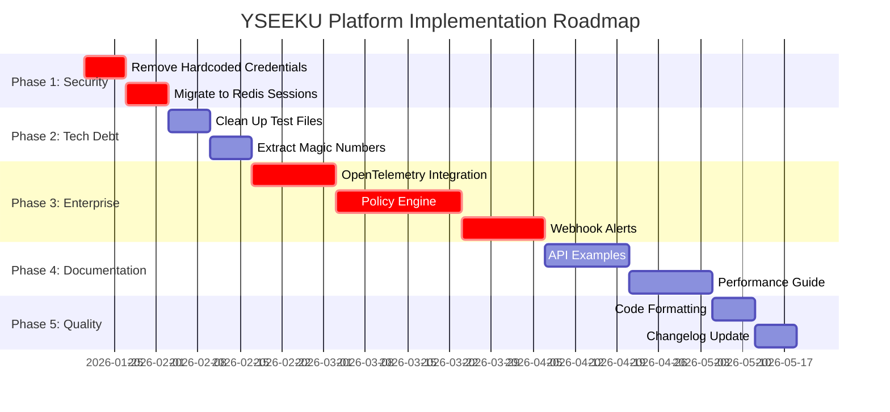

# YSEEKU Platform - Implementation Roadmap

**Based on Code Review Findings**  
**Target Completion: Q2 2026**  
**Priority: Enterprise Readiness**

---

## Executive Summary

This roadmap addresses the 10 key action items identified in the comprehensive code review. The plan prioritizes **security cleanup** and **enterprise features** to prepare the platform for production deployments and customer pilots.

---

## Phase 1: Security & Compliance (Weeks 1-4)

### 🔴 **Priority: CRITICAL** - Security Cleanup

#### 1.1 Remove Hardcoded Credentials
**Files:** `packages/core/src/security/auth-service.ts`, `apps/web/src/components/login.tsx`

**Actions:**
- Remove test credentials from `SecureAuthService.validateCredentials()`
- Remove placeholder text from login form (`placeholder="admin123"`)
- Implement environment-based credential loading
- Add production credential validation

**Acceptance Criteria:**
```typescript
// Before (remove)
{ username: 'admin', passwordHash: await this.hashPassword('admin123!') }

// After (environment-based)
const testUsers = await this.loadTestUsersFromEnv();
```

#### 1.2 Migrate Session Store to Redis
**File:** `packages/core/src/security/auth-service.ts`

**Actions:**
- Replace `Map<string, Session>` with Redis client
- Add Redis configuration with fallback
- Implement session persistence across restarts
- Add session cleanup TTL

**Implementation:**
```typescript
// New RedisSessionStore
class RedisSessionStore {
  private redis: Redis;
  
  async set(sessionId: string, session: SessionData): Promise<void> {
    await this.redis.setex(sessionId, 3600, JSON.stringify(session));
  }
  
  async get(sessionId: string): Promise<SessionData | null> {
    const data = await this.redis.get(sessionId);
    return data ? JSON.parse(data) : null;
  }
}
```

---

## Phase 2: Technical Debt Resolution (Weeks 5-6)

### 🟡 **Priority: MEDIUM** - Code Quality

#### 2.1 Clean Up Test Files
**Files:** `packages/core/src/__tests__/*-broken.spec.ts`

**Actions:**
- Review each broken test file
- Either fix and rename to proper `.spec.ts` or remove
- Ensure test coverage remains ≥80%

#### 2.2 Extract Magic Numbers
**Files:** `packages/detect/src/bedau-index.ts`, `packages/detect/src/v2.ts`

**Actions:**
```typescript
// Create constants file: packages/core/src/constants/algorithmic.ts
export const BEDAU_INDEX_CONSTANTS = {
  BASELINE_RANDOM_SCORE: 0.3,
  POOLLED_STANDARD_DEVIATION: 0.25,
  BOOTSTRAP_SAMPLES: 1000,
  CONFIDENCE_LEVEL: 0.95,
} as const;

export const RESONANCE_WEIGHTS = {
  ALIGNMENT: 0.3,
  CONTINUITY: 0.3,
  SCAFFOLD: 0.2,
  ETHICS: 0.2,
} as const;
```

---

## Phase 3: Enterprise Features (Weeks 7-12)

### 🔴 **Priority: HIGH** - Market Readiness

#### 3.1 OpenTelemetry Integration
**New Package:** `packages/observability`

**Implementation:**
```typescript
// packages/observability/src/index.ts
import { trace, metrics, Context } from '@opentelemetry/api';

export class TrustMetrics {
  private tracer = trace.getTracer('@sonate/core');
  private meter = metrics.getMeter('@sonate/core');
  
  // Create metrics
  private trustScoreHistogram = this.meter.createHistogram('trust.score', {
    unit: 'score',
    description: 'Trust score distribution'
  });
  
  recordTrustScore(score: number, principles: PrincipleScores) {
    this.tracer.startSpan('trust.scoring').setAttributes({
      'trust.score': score,
      'trust.principles.violations': principles.violations.length
    });
    
    this.trustScoreHistogram.record(score);
  }
}
```

**Integration Points:**
- `@sonate/core` - Trust protocol scoring
- `@sonate/detect` - Real-time detection metrics
- `@sonate/orchestrate` - Agent orchestration metrics

#### 3.2 Policy Composition Engine
**New Package:** `packages/policy-engine`

**Features:**
```typescript
interface PolicyComposition {
  id: string;
  name: string;
  base_principles: TrustPrincipleKey[];
  custom_weights?: Partial<Record<TrustPrincipleKey, number>>;
  organization_overrides?: OrganizationPolicy[];
  compliance_mappings?: ComplianceMapping[];
}

class PolicyEngine {
  composePolicy(base: PolicyConfig, custom: Partial<PolicyConfig>): PolicyComposition;
  evaluateInteraction(interaction: Interaction, policy: PolicyComposition): TrustScore;
  validateCompliance(policy: PolicyComposition, framework: 'EU_AI_ACT' | 'SOC2' | 'GDPR'): ComplianceReport;
}
```

**Use Cases:**
- Healthcare: Higher ethical override weight
- Finance: Enhanced inspection mandate
- Government: Strict consent architecture

#### 3.3 Webhook Alert System
**Enhancement:** `packages/core/src/alerting/`

**Implementation:**
```typescript
interface AlertWebhook {
  id: string;
  url: string;
  events: AlertEventType[];
  secret: string; // HMAC signing
  filters?: AlertFilter[];
}

class WebhookManager {
  async registerWebhook(webhook: AlertWebhook): Promise<void>;
  async triggerAlert(event: AlertEvent): Promise<void>;
  private async signPayload(payload: any, secret: string): Promise<string>;
}

// Alert events
type AlertEventType = 
  | 'trust_violation_critical'
  | 'emergence_detected'
  | 'identity_drift'
  | 'compliance_breach';
```

---

## Phase 4: Documentation & Integration (Weeks 13-16)

### 🟡 **Priority: MEDIUM** - Developer Experience

#### 4.1 API Documentation Enhancement
**Files:** `docs/API.md`, new `docs/examples/`

**Add:**
- Request/response examples for all endpoints
- Integration tutorials for common use cases
- SDK examples (TypeScript, Python)
- Troubleshooting guide

#### 4.2 Performance Tuning Guide
**New File:** `docs/PERFORMANCE_TUNING.md`

**Content:**
- Detection latency optimization
- Throughput scaling strategies
- Memory usage tuning
- Kubernetes resource allocation

---

## Phase 5: Code Quality & Automation (Weeks 17-20)

### 🟢 **Priority: LOW** - Maintainability

#### 5.1 Code Formatting Enforcement
**File:** `.eslintrc.js`

**Enhancements:**
```javascript
module.exports = {
  rules: {
    '@typescript-eslint/brace-style': ['error', '1tbs'],
    '@typescript-eslint/quotes': ['error', 'single'],
    'no-magic-numbers': ['error', { 
      ignore: [-1, 0, 1, 2], 
      ignoreArrayIndexes: true,
      enforceConst: true 
    }]
  }
};
```

#### 5.2 Changelog Update
**File:** `CHANGELOG.md`

**Add v1.4.0 entries:**
- SYMBI Trust Framework implementation
- Bedau Index emergence detection
- Phase-Shift Velocity metrics
- Cryptographic trust receipts
- Enterprise security features

---

## Implementation Timeline



---

## Success Metrics

### Technical Metrics
- [ ] Zero hardcoded credentials in production code
- [ ] Redis session store with 99.9% uptime
- [ ] OpenTelemetry metrics collection active
- [ ] Policy engine supporting 3+ industry templates
- [ ] Webhook alert delivery <100ms

### Business Metrics
- [ ] Enterprise pilot deployment ready
- [ ] Compliance documentation complete (EU AI Act, SOC2)
- [ ] Developer onboarding time <2 hours
- [ ] Support ticket reduction 30%

---

## Risk Mitigation

| Risk | Impact | Mitigation |
|------|--------|------------|
| Redis dependency | Medium | Fallback to in-memory store |
| OpenTelemetry complexity | Low | Start with basic metrics |
| Policy engine scope creep | Medium | MVP with 3 templates only |
| Webhook reliability | Medium | Retry logic + dead letter queue |

---

## Next Steps

1. **Week 1:** Begin security cleanup (highest ROI)
2. **Week 2:** Set up Redis infrastructure
3. **Week 3:** Start OpenTelemetry PoC
4. **Week 4:** Define policy engine requirements with early customers

---

*This roadmap prioritizes enterprise readiness while maintaining the platform's innovative core features. The phased approach ensures steady progress toward production deployment.*
