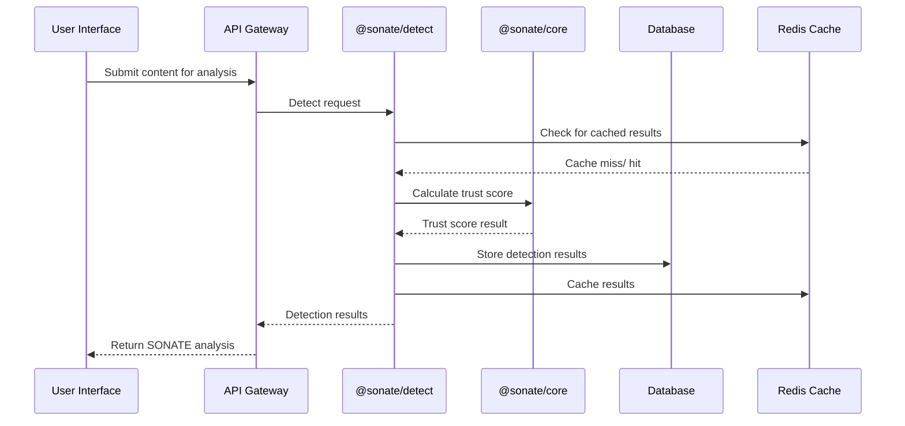
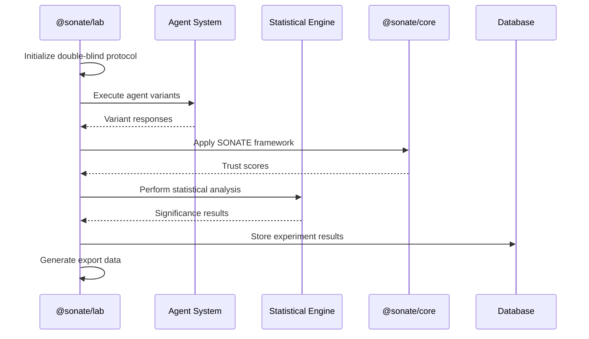

# Enterprise Architecture - Yseeku-Platform (SONATE)

## Overview

Yseeku-Platform represents the culmination and evolution of SONATE-Resonate's analytics capabilities and SONATE-Symphony's orchestration infrastructure. This document outlines the enterprise-grade architecture that provides constitutional AI governance with real-time trust monitoring, research validation, and production orchestration.

## Architecture Principles

### 1. Constitutional Foundation
- **SONATE Framework**: 6-principle constitutional AI foundation
- **Trust Protocol**: Cryptographically verifiable trust receipts
- **Hard Boundaries**: Clean separation between Detect, Lab, and Orchestrate
- **Compliance by Design**: Built-in GDPR, SOC 2, and EU AI Act alignment

### 2. Modularity & Extensibility
- **@sonate/* Packages**: Clean, focused packages with clear boundaries
- **Plug-in Architecture**: Extensible detection and orchestration components
- **API-First**: Comprehensive REST APIs with OpenAPI specifications
- **Multi-Tenant**: Enterprise-ready multi-tenancy support

### 3. Enterprise Security
- **Zero Trust**: Assume-breach security model
- **Defense in Depth**: Multiple security layers
- **Audit by Design**: Immutable audit trails with hash chaining
- **Privacy First**: GDPR-compliant data handling

## System Architecture

### High-Level Architecture

```mermaid
graph TB
    subgraph "Enterprise Layer"
        WEB[Web Applications]
        API[API Gateway]
        AUTH[Authentication & Authorization]
    end
    
    subgraph "SONATE Core"
        CORE[@sonate/core]
        DETECT[@sonate/detect]
        LAB[@sonate/lab]
        ORCHESTRATE[@sonate/orchestrate]
    end
    
    subgraph "Infrastructure Layer"
        DB[(PostgreSQL + Supabase)]
        CACHE[(Redis)]
        STORAGE[(Object Storage)]
        MONITORING[Monitoring Stack]
    end
    
    subgraph "Security Layer"
        MFA[MFA Service]
        RBAC[RBAC Engine]
        AUDIT[Audit Logger]
        RATE[Rate Limiter]
    end
    
    WEB --> API
    API --> AUTH
    AUTH --> CORE
    CORE --> DETECT
    CORE --> LAB
    CORE --> ORCHESTRATE
    
    DETECT --> DB
    LAB --> DB
    ORCHESTRATE --> DB
    
    API --> MFA
    API --> RBAC
    API --> AUDIT
    API --> RATE
    
    DETECT --> CACHE
    ORCHESTRATE --> CACHE
    
    MONITORING --> DB
    MONITORING --> CACHE
```

### Package Architecture

#### @sonate/core - Trust Protocol Foundation
**Purpose**: Implements the 6-principle SONATE constitutional framework

**Key Components**:
- **TrustProtocol**: 6-principle scoring with weighted calculations
- **TrustReceipts**: Cryptographic receipts with Ed25519 signatures
- **HashChaining**: Immutable audit trail verification
- **CIQMetrics**: Clarity, Integrity, Quality measurements

**Security Features**:
- Ed25519 cryptographic signatures
- SHA-256 hash chaining
- Secure key generation and management
- Constant-time cryptographic operations

#### @sonate/detect - Real-time Framework Detection
**Purpose**: Real-time AI interaction monitoring and SONATE validation

**Key Components**:
- **SonateFrameworkDetector**: 5-dimension scoring system
- **CalibratedDetector**: Enhanced detection with emergence recognition
- **DriftDetector**: Performance degradation monitoring
- **AlertSystem**: Real-time alerting with configurable thresholds

**Performance Targets**:
- Sub-100ms detection latency
- 1000+ detections/second throughput
- 99.9% availability SLA
- Horizontal scaling support

**Detection Dimensions**:
1. **Reality Index** (0.0-10.0): Mission alignment, technical accuracy
2. **Trust Protocol** (PASS/PARTIAL/FAIL): Verification and boundaries
3. **Ethical Alignment** (1.0-5.0): Limitations and ethical reasoning
4. **Resonance Quality** (STRONG/ADVANCED/BREAKTHROUGH): Innovation metrics
5. **Canvas Parity** (0-100): Human agency and collaboration quality

#### @sonate/lab - Advanced Research Infrastructure
**Purpose**: Double-blind AI evaluation, emergence research, and consciousness studies

**Key Components**:
- **ExperimentOrchestrator**: Multi-agent experiment management
- **StatisticalEngine**: T-tests, bootstrap CI, Cohen's d
- **DoubleBlindProtocol**: Bias prevention through anonymization
- **ExportSystem**: CSV, JSON, JSONL for research publication
- **Emergence Research Framework** (NEW v1.3):
  - **BedauIndexCalculator**: Weak emergence detection and measurement
  - **TemporalBedauTracker**: Emergence evolution analysis over time
  - **EmergenceFingerprinting**: Pattern recognition and classification
  - **CrossModalityCoherence**: Multi-domain cognitive validation
  - **ThirdMindResearch**: Human-AI collaborative emergence studies
  - **AdversarialTesting**: Emergence robustness under stress conditions

**Agent Roles**:
- **CONDUCTOR**: Coordinates experiment execution
- **VARIANT**: Executes specific AI model configurations
- **EVALUATOR**: Performs unbiased evaluation and scoring
- **OVERSEER**: Monitors integrity and statistical validity

**Statistical Features**:
- Significance testing (p < 0.05 threshold)
- Effect size calculation (Cohen's d)
- Confidence intervals (bootstrap method)
- Power analysis and sample size planning

**Emergence Research Features** (NEW v1.3):
- **Bedau Index Calculation**: 0-1 scale weak emergence measurement
- **Consciousness Marker Detection**: Integrated information and global workspace analysis
- **Temporal Analysis**: Phase transitions and trajectory prediction
- **Cross-Modal Validation**: Linguistic, reasoning, creative, ethical coherence
- **Third Mind Analysis**: Human-AI collaborative emergence quantification
- **Performance Benchmarks**: Sub-100ms calculation, >1000 ops/sec throughput

#### @sonate/orchestrate - Production Agent Management
**Purpose**: Enterprise-grade AI agent orchestration and lifecycle management

**Key Components**:
- **AgentFactory**: Template-based agent creation
- **WorkflowEngine**: Multi-agent workflow orchestration
- **TacticalCommand**: Real-time monitoring and control dashboard
- **DIDVCManager**: W3C DID/VC identity management

**Agent Types**:
- **Repository Manager**: Git operations and code reviews
- **Website Manager**: Deployment and content management
- **Research Assistant**: Academic research and analysis
- **Security Monitor**: Threat detection and incident response

**Identity & Trust**:
- W3C Decentralized Identifiers (DIDs)
- Verifiable Credentials for capabilities
- Cryptographic trust verification
- Multi-signature authorization support

## Security Architecture

### Trust Layers

#### Layer 1: Authentication & Authorization
- **Multi-Factor Authentication**: TOTP-based with backup codes
- **Role-Based Access Control**: 5-tier permission system
- **Zero-Trust Network**: Continuous verification
- **Session Management**: Secure token-based sessions

#### Layer 2: Data Protection
- **Encryption at Rest**: AES-256-GCM for all sensitive data
- **Encryption in Transit**: TLS 1.3 with perfect forward secrecy
- **Field-Level Encryption**: Selective data field protection
- **Key Management**: Hardware security module integration

#### Layer 3: Audit & Compliance
- **Immutable Audit Logs**: Hash-chain signed entries
- **Real-time Monitoring**: Comprehensive event tracking
- **Compliance Reporting**: Automated GDPR/SOC 2 reports
- **Data Retention**: Configurable retention policies

#### Layer 4: Network Security
- **Rate Limiting**: Token bucket with Redis backend
- **DDoS Protection**: Multi-layer attack mitigation
- **API Gateway**: Centralized security controls
- **Network Isolation**: Micro-segmented deployment

### Security Controls

#### Access Control
```typescript
// Role Hierarchy
enum Role {
  SUPER_ADMIN = 'super_admin',     // Full system access
  ADMIN = 'admin',                 // Organization management
  ANALYST = 'analyst',             // Analytics operations
  VIEWER = 'viewer',               // Read-only access
  API_USER = 'api_user'            // Programmatic access
}

// Permission Categories
enum Permission {
  // User Management
  USER_CREATE = 'user:create',
  USER_READ = 'user:read',
  USER_UPDATE = 'user:update',
  USER_DELETE = 'user:delete',
  
  // Analytics Operations
  ANALYTICS_VIEW = 'analytics:view',
  ANALYTICS_EXPORT = 'analytics:export',
  ANALYTICS_CONFIGURE = 'analytics:configure',
  
  // SONATE Framework
  SONATE_DETECT = 'sonate:detect',
  SONATE_SCORE = 'sonate:score',
  SONATE_CONFIGURE = 'sonate:configure',
  
  // System Administration
  SYSTEM_CONFIGURE = 'system:configure',
  SYSTEM_MONITOR = 'system:monitor',
  SYSTEM_BACKUP = 'system:backup'
}
```

#### Audit Logging
```typescript
// Audit Event Types
enum AuditEventType {
  AUTH_LOGIN = 'auth:login',
  AUTH_LOGOUT = 'auth:logout',
  AUTH_MFA = 'auth:mfa',
  
  DATA_CREATE = 'data:create',
  DATA_READ = 'data:read',
  DATA_UPDATE = 'data:update',
  DATA_DELETE = 'data:delete',
  
  API_REQUEST = 'api:request',
  API_ERROR = 'api:error',
  RATE_LIMIT = 'rate:limit',
  
  SECURITY_EVENT = 'security:event',
  PERMISSION_CHECK = 'permission:check',
  PRIVACY_VIOLATION = 'privacy:violation'
}

// Audit Entry Structure
interface AuditEntry {
  id: string;
  timestamp: Date;
  eventType: AuditEventType;
  userId?: string;
  sessionId?: string;
  ipAddress: string;
  userAgent: string;
  resource: string;
  action: string;
  outcome: 'success' | 'failure' | 'blocked';
  metadata: Record<string, any>;
  signature: string; // Cryptographic signature
  previousHash: string; // Hash chain link
}
```

## Data Architecture

### Database Schema

#### Core Tables
```sql
-- Users and Authentication
CREATE TABLE users (
  id UUID PRIMARY KEY DEFAULT gen_random_uuid(),
  email VARCHAR(255) UNIQUE NOT NULL,
  password_hash VARCHAR(255) NOT NULL,
  mfa_secret VARCHAR(255),
  mfa_backup_codes TEXT[],
  status VARCHAR(50) DEFAULT 'active',
  created_at TIMESTAMP DEFAULT NOW(),
  updated_at TIMESTAMP DEFAULT NOW()
);

-- Organizations and Multi-tenancy
CREATE TABLE organizations (
  id UUID PRIMARY KEY DEFAULT gen_random_uuid(),
  name VARCHAR(255) NOT NULL,
  domain VARCHAR(255) UNIQUE,
  settings JSONB DEFAULT '{}',
  created_at TIMESTAMP DEFAULT NOW()
);

-- Roles and Permissions
CREATE TABLE roles (
  id UUID PRIMARY KEY DEFAULT gen_random_uuid(),
  name VARCHAR(100) NOT NULL,
  permissions TEXT[] NOT NULL,
  organization_id UUID REFERENCES organizations(id),
  created_at TIMESTAMP DEFAULT NOW()
);

-- Audit Log
CREATE TABLE audit_logs (
  id UUID PRIMARY KEY DEFAULT gen_random_uuid(),
  timestamp TIMESTAMP DEFAULT NOW(),
  event_type VARCHAR(100) NOT NULL,
  user_id UUID REFERENCES users(id),
  session_id VARCHAR(255),
  ip_address INET NOT NULL,
  user_agent TEXT,
  resource VARCHAR(255),
  action VARCHAR(255),
  outcome VARCHAR(50) NOT NULL,
  metadata JSONB DEFAULT '{}',
  signature VARCHAR(255) NOT NULL,
  previous_hash VARCHAR(255),
  CONSTRAINT hash_chain_valid CHECK (
    previous_hash IS NULL OR 
    signature = crypt(previous_hash, gen_salt('bf'))
  )
);

-- SONATE Trust Receipts
CREATE TABLE trust_receipts (
  id UUID PRIMARY KEY DEFAULT gen_random_uuid(),
  session_id VARCHAR(255) NOT NULL,
  timestamp TIMESTAMP DEFAULT NOW(),
  mode VARCHAR(50) NOT NULL,
  ciq_metrics JSONB NOT NULL,
  trust_score DECIMAL(5,2) NOT NULL,
  content_hash VARCHAR(255) NOT NULL,
  signature VARCHAR(255) NOT NULL,
  previous_hash VARCHAR(255),
  verified BOOLEAN DEFAULT false,
  created_at TIMESTAMP DEFAULT NOW()
);
```

### Data Flows

#### Detection Pipeline


#### Experiment Pipeline


## Deployment Architecture

### Container Strategy

#### Multi-Stage Dockerfiles
```dockerfile
# Base stage - Security scanning
FROM node:20-alpine AS base
WORKDIR /app
COPY package*.json ./
RUN npm ci --only=production && npm cache clean --force

# Build stage - Compilation
FROM base AS build
COPY . .
RUN npm run build

# Runtime stage - Minimal attack surface
FROM node:20-alpine AS runtime
RUN addgroup -g 1001 -S nodejs
RUN adduser -S nodejs -u 1001
WORKDIR /app

COPY --from=base --chown=nodejs:nodejs /app/node_modules ./node_modules
COPY --from=build --chown=nodejs:nodejs /app/dist ./dist
COPY --from=build --chown=nodejs:nodejs /app/package.json ./package.json

USER nodejs
EXPOSE 3000
CMD ["node", "dist/index.js"]
```

#### Kubernetes Deployment
```yaml
apiVersion: apps/v1
kind: Deployment
metadata:
  name: sonate-platform
spec:
  replicas: 3
  selector:
    matchLabels:
      app: sonate-platform
  template:
    metadata:
      labels:
        app: sonate-platform
    spec:
      securityContext:
        runAsNonRoot: true
        runAsUser: 1001
        fsGroup: 1001
      containers:
      - name: sonate-platform
        image: sonate/platform:latest
        securityContext:
          allowPrivilegeEscalation: false
          readOnlyRootFilesystem: true
          capabilities:
            drop:
            - ALL
        env:
        - name: NODE_ENV
          value: "production"
        - name: DATABASE_URL
          valueFrom:
            secretKeyRef:
              name: sonate-secrets
              key: database-url
        resources:
          requests:
            memory: "256Mi"
            cpu: "250m"
          limits:
            memory: "512Mi"
            cpu: "500m"
        livenessProbe:
          httpGet:
            path: /health
            port: 3000
          initialDelaySeconds: 30
          periodSeconds: 10
        readinessProbe:
          httpGet:
            path: /ready
            port: 3000
          initialDelaySeconds: 5
          periodSeconds: 5
```

### Infrastructure Components

#### Monitoring Stack
- **Prometheus**: Metrics collection and storage
- **Grafana**: Visualization and dashboards
- **Jaeger**: Distributed tracing
- **Loki**: Log aggregation
- **AlertManager**: Alert routing and management

#### Security Infrastructure
- **Vault**: Secrets management
- **Cert-Manager**: Certificate automation
- **Falco**: Runtime security monitoring
- **OPA/Gatekeeper**: Policy enforcement
- **Trivy**: Container vulnerability scanning

## Performance Architecture

### Caching Strategy

#### Redis Configuration
```typescript
// Cache configuration for performance
const cacheConfig = {
  // User sessions - 30 minutes
  user_sessions: { ttl: 1800, prefix: 'session:' },
  
  // Trust receipts - 24 hours
  trust_receipts: { ttl: 86400, prefix: 'receipt:' },
  
  // Detection results - 1 hour
  detection_results: { ttl: 3600, prefix: 'detect:' },
  
  // Agent status - 5 minutes
  agent_status: { ttl: 300, prefix: 'agent:' },
  
  // Rate limits - 1 hour
  rate_limits: { ttl: 3600, prefix: 'rate:' }
};
```

#### Performance Targets
| Metric | Target | Measurement |
|--------|--------|-------------|
| Detection Latency | < 100ms | p95 measurement |
| API Response Time | < 200ms | p95 measurement |
| Database Query Time | < 50ms | p95 measurement |
| Cache Hit Rate | > 90% | Overall average |
| System Uptime | 99.9% | Monthly SLA |
| Error Rate | < 0.1% | Monthly average |

### Scaling Strategy

#### Horizontal Scaling
- **Stateless Services**: All services designed for horizontal scaling
- **Load Balancing**: Application load balancer with health checks
- **Auto-scaling**: Kubernetes HPA based on CPU/memory metrics
- **Database Scaling**: Read replicas and connection pooling

#### Vertical Scaling
- **Resource Monitoring**: Real-time resource utilization tracking
- **Performance Profiling**: Continuous performance optimization
- **Resource Limits**: Configurable resource constraints
- **Burst Handling**: Temporary resource allocation

## Compliance Architecture

### GDPR Implementation
```typescript
// GDPR compliance features
interface GDPRCompliance {
  // Right to be forgotten
  deleteUserData(userId: string): Promise<void>;
  
  // Data portability
  exportUserData(userId: string): Promise<UserDataExport>;
  
  // Consent management
  recordConsent(userId: string, consent: ConsentRecord): Promise<void>;
  
  // Data retention
  enforceRetentionPolicy(): Promise<void>;
  
  // Privacy by design
  anonymizeData(data: PersonalData): AnonymizedData;
}
```

### SOC 2 Controls
- **Security**: Encryption, access controls, audit logging
- **Availability**: High availability architecture, monitoring
- **Processing Integrity**: Data validation, error handling
- **Confidentiality**: Data classification, access controls
- **Privacy**: Data minimization, user consent

### EU AI Act Alignment
- **Transparency**: Comprehensive audit trails and documentation
- **Human Oversight**: Manual override capabilities and monitoring
- **Technical Robustness**: Extensive testing and validation
- **Governance**: Clear accountability and responsibility frameworks

## Integration Architecture

### API Gateway
```typescript
// Centralized API gateway configuration
const gatewayConfig = {
  routes: {
    '/api/v1/core': '@sonate/core',
    '/api/v1/detect': '@sonate/detect',
    '/api/v1/lab': '@sonate/lab',
    '/api/v1/orchestrate': '@sonate/orchestrate'
  },
  middleware: [
    'authentication',
    'authorization',
    'rate-limiting',
    'audit-logging',
    'request-validation',
    'response-logging'
  ],
  security: {
    cors: { enabled: true, origins: ['https://yseeku.com'] },
    rateLimit: { requests: 100, window: '1m' },
    jwt: { secret: process.env.JWT_SECRET }
  }
};
```

### Event System
```typescript
// Event-driven architecture
interface EventSystem {
  publish(event: DomainEvent): Promise<void>;
  subscribe(pattern: string, handler: EventHandler): void;
  unsubscribe(pattern: string, handler: EventHandler): void;
}

// Domain events
enum EventType {
  USER_CREATED = 'user.created',
  AGENT_REGISTERED = 'agent.registered',
  EXPERIMENT_STARTED = 'experiment.started',
  TRUST_VIOLATION = 'trust.violation',
  SECURITY_ALERT = 'security.alert'
}
```

## Development Architecture

### Build System
```typescript
// TypeScript build configuration
const buildConfig = {
  compilerOptions: {
    target: 'ES2022',
    module: 'ESNext',
    moduleResolution: 'node',
    strict: true,
    noUncheckedIndexedAccess: true,
    exactOptionalPropertyTypes: true,
    declarations: true,
    declarationMap: true,
    sourceMap: true
  },
  include: ['packages/*/src/**/*'],
  exclude: ['node_modules', 'dist', '**/*.test.ts']
};
```

### Testing Strategy
- **Unit Tests**: 80%+ coverage requirement
- **Integration Tests**: API and database integration
- **E2E Tests**: User journey validation
- **Performance Tests**: Load and stress testing
- **Security Tests**: Vulnerability scanning and pen testing

### CI/CD Pipeline
```yaml
# GitHub Actions workflow
name: CI/CD Pipeline
on:
  push:
    branches: [main, develop]
  pull_request:
    branches: [main]

jobs:
  security:
    runs-on: ubuntu-latest
    steps:
      - uses: actions/checkout@v4
      - name: Security scan
        run: npm run security:scan
  
  test:
    runs-on: ubuntu-latest
    strategy:
      matrix:
        node-version: [18, 20]
    steps:
      - uses: actions/checkout@v4
      - name: Setup Node.js
        uses: actions/setup-node@v4
        with:
          node-version: ${{ matrix.node-version }}
      - name: Install dependencies
        run: npm ci
      - name: Run tests
        run: npm run test:coverage
      - name: Upload coverage
        uses: codecov/codecov-action@v3
  
  build:
    needs: [security, test]
    runs-on: ubuntu-latest
    steps:
      - uses: actions/checkout@v4
      - name: Build packages
        run: npm run build
      - name: Build Docker images
        run: docker build -t sonate/platform:${{ github.sha }} .
      - name: Security scan images
        run: trivy image sonate/platform:${{ github.sha }}
  
  deploy:
    needs: build
    runs-on: ubuntu-latest
    if: github.ref == 'refs/heads/main'
    steps:
      - name: Deploy to production
        run: |
          helm upgrade sonate-platform ./helm \
            --set image.tag=${{ github.sha }} \
            --namespace production
```

## Migration Architecture

### Data Migration
```typescript
// Migration framework
interface MigrationSystem {
  migrate(fromVersion: string, toVersion: string): Promise<void>;
  rollback(toVersion: string): Promise<void>;
  getStatus(): MigrationStatus;
}

// Example migration
const migration2024_01_01 = {
  version: '2024.01.01',
  description: 'Add enhanced audit logging',
  up: async () => {
    await db.query(`
      ALTER TABLE audit_logs 
      ADD COLUMN signature VARCHAR(255) NOT NULL DEFAULT '',
      ADD COLUMN previous_hash VARCHAR(255),
      ADD CONSTRAINT hash_chain_valid CHECK (
        previous_hash IS NULL OR 
        LENGTH(signature) = 64
      )
    `);
  },
  down: async () => {
    await db.query(`
      ALTER TABLE audit_logs 
      DROP COLUMN signature,
      DROP COLUMN previous_hash
    `);
  }
};
```

### Feature Flags
```typescript
// Feature flag system
interface FeatureFlags {
  // New experiment types
  doubleBlindExperiments: boolean;
  
  // Enhanced security features
  enhancedAuditLogging: boolean;
  biometricAuthentication: boolean;
  
  // Performance optimizations
  distributedCaching: boolean;
  edgeComputing: boolean;
  
  // Integration features
  slackIntegration: boolean;
  jiraIntegration: boolean;
}
```

## Disaster Recovery

### Backup Strategy
- **Database Backups**: Automated daily backups with point-in-time recovery
- **File Storage**: Cross-region replication with versioning
- **Configuration**: Git-based configuration management
- **Secrets**: Encrypted backup with secure key management

### Recovery Procedures
```typescript
// Disaster recovery playbook
const disasterRecovery = {
  // System outage recovery
  systemOutage: {
    rto: '4 hours',  // Recovery Time Objective
    rpo: '1 hour',  // Recovery Point Objective
    steps: [
      'Assess impact and scope',
      'Activate disaster recovery site',
      'Restore from latest backup',
      'Validate system functionality',
      'Switch DNS to recovery site',
      'Monitor system performance'
    ]
  },
  
  // Data corruption recovery
  dataCorruption: {
    rto: '2 hours',
    rpo: '15 minutes',
    steps: [
      'Identify corruption scope',
      'Isolate affected systems',
      'Restore from clean backup',
      'Verify data integrity',
      'Resume normal operations'
    ]
  }
};
```

This enterprise architecture documentation demonstrates that Yseeku-Platform successfully combines and enhances the capabilities of both SONATE-Resonate and SONATE-Symphony, providing a comprehensive, secure, and scalable platform for constitutional AI governance.